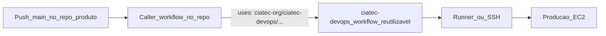

# Como conectar seu repositório ao CD do CIATec

Este guia ensina a plugar um repositório de produto no `ciatec-devops`, para que
**push em `main` atualize a produção automaticamente**.

---

## Como funciona (visão geral)



1. Você trabalha no **repo do produto** (jogo ou monorepo).
2. Ao atualizar `main`, um workflow **mínimo** nesse repo (o *caller*) dispara.
3. O caller **chama** um workflow reutilizável deste repositório (`ciatec-devops`).
4. O `ciatec-devops` sabe o que fazer (WebGL ou Docker) e atualiza a EC2.

O repo de produto **não** precisa copiar a lógica de deploy — só o arquivo caller.

---

## Pré-requisitos (uma vez por org)

- Repositório `ciatec-org/ciatec-devops` com os workflows em `main`
- Em cada repo produto: Settings → Actions → General → permitir usar workflows de outros repos da org
- Em `ciatec-devops`: Settings → Actions → General → **Accessible from repositories in the organization**

---

## A) Jogo Unity WebGL (TrunkTilt, Bubbles, Downhill, …)

### O que o devops faz

Roda no **self-hosted runner** da EC2 Games: copia `Build/` para o Nginx, backup, reload.

### Passo a passo

1. No servidor, prepare o path (ex.: `/var/www/meu-jogo`) e o Nginx.
2. No repo do jogo, crie `.github/workflows/deploy.yml` copiando:
   [`docs/templates/game-deploy-caller.yml`](templates/game-deploy-caller.yml)
3. Altere **só** estas duas linhas:

```yaml
game_name: meu-jogo
deploy_path: /var/www/meu-jogo
```

4. Garanta que a pasta `Build/` existe na raiz do repo (artefato Unity WebGL).
5. Push em `main` → acompanhe em Actions do repo do jogo.

### Secrets (opcional)

| Secret | Onde | Uso |
|--------|------|-----|
| `DEPLOY_LOG_PATH` | Org ou repo | Log no servidor (default `/var/log/ciatec/deploys.log`) |

Use `secrets: inherit` no caller (já vem no template).

### Runbook completo

[adicionar-novo-jogo.md](runbooks/adicionar-novo-jogo.md)

---

## B) Monorepo (API + App Docker)

### O que o devops faz

Via **SSH** na EC2 API/App: `docker compose pull/up`, health check, rollback; na API, migrações Alembic antes.

### Passo a passo

1. Configure os secrets na **organização** (ou no monorepo):

| Secret | Conteúdo |
|--------|----------|
| `EC2_API_HOST` | IP/hostname da EC2 API/App |
| `EC2_SSH_KEY` | Chave privada PEM |
| `EC2_SSH_USER` | Usuário SSH (ex.: `ubuntu`) |

2. No monorepo, crie `.github/workflows/deploy.yml` copiando:
   [`docs/templates/monorepo-deploy-caller.yml`](templates/monorepo-deploy-caller.yml)
3. Confirme que as pastas no monorepo batem com o template (`api/`, `app/`, `docker-compose.yml`). Se os nomes forem outros, ajuste o `paths-filter`.
4. Push em `main` alterando `api/` ou `app/` → Actions chama o deploy certo.

### Runbook completo

[deploy-monorepo.md](runbooks/deploy-monorepo.md)

---

## Checklist rápido

**Jogo WebGL**

- [ ] Path Nginx criado na EC2 Games
- [ ] Runner self-hosted online na EC2 Games
- [ ] `.github/workflows/deploy.yml` no repo do jogo
- [ ] `game_name` e `deploy_path` corretos
- [ ] `Build/` na raiz
- [ ] Acesso cross-repo Actions liberado

**Monorepo**

- [ ] Secrets `EC2_API_HOST`, `EC2_SSH_KEY`, `EC2_SSH_USER`
- [ ] Scripts em `/opt/ciatec/scripts/` (o workflow copia automaticamente)
- [ ] `.github/workflows/deploy.yml` no monorepo
- [ ] Compose em `/opt/ciatec/` (ou `COMPOSE_DIR` no servidor)

---

## Como verificar

1. GitHub → Actions no repo do produto (job verde/vermelho)
2. Servidor WebGL: `tail -n 20 /var/log/ciatec/deploys.log`
3. Servidor Docker: `docker compose -f /opt/ciatec/docker-compose.yml ps`
4. Health: rode `scripts/health/check-all.sh` (com URLs exportadas)

---

## Arquitetura detalhada

Ver [architecture.md](architecture.md).
