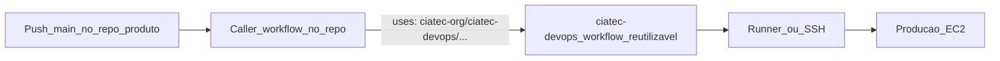

# Como conectar seu repositório ao CD do CIATec

Este guia ensina a plugar um repositório de produto no `ciatec-devops`, para que
**push em `main` atualize a produção automaticamente**.

---

## Como funciona (visão geral)



1. Você trabalha no **repo do produto** (jogo ou monorepo).
2. Ao atualizar `main`, um workflow **mínimo** nesse repo (o *caller*) dispara.
3. O caller **chama** um workflow reutilizável deste repositório (`ciatec-devops`).
4. O `ciatec-devops` sabe o que fazer (WebGL ou Docker) e atualiza a EC2.

O repo de produto **não** precisa copiar a lógica de deploy — só o arquivo caller.

---

## Pré-requisitos (uma vez por org)

- Repositório `ciatec-org/ciatec-devops` com os workflows em `main`
- Em cada repo produto: Settings → Actions → General → permitir usar workflows de outros repos da org
- Em `ciatec-devops`: Settings → Actions → General → **Accessible from repositories in the organization**

---

## A) Jogo Unity WebGL (TrunkTilt, Bubbles, Downhill, …)

### O que o devops faz

Roda no **self-hosted runner** da EC2 Games: copia `Build/` para o Nginx, backup, reload.

### Passo a passo

1. No servidor, prepare o path (ex.: `/var/www/meu-jogo`) e o Nginx.
2. No repo do jogo, crie `.github/workflows/deploy.yml` copiando:
   [`docs/templates/game-deploy-caller.yml`](templates/game-deploy-caller.yml)
3. Altere **só** estas duas linhas:

```yaml
game_name: meu-jogo
deploy_path: /var/www/meu-jogo
```

4. Garanta que a pasta `Build/` existe na raiz do repo (artefato Unity WebGL).
5. Push em `main` → acompanhe em Actions do repo do jogo.

### Secrets (opcional)

| Secret | Onde | Uso |
|--------|------|-----|
| `DEPLOY_LOG_PATH` | Org ou repo | Log no servidor (default `/var/log/ciatec/deploys.log`) |

Use `secrets: inherit` no caller (já vem no template).

### Runbook completo

[adicionar-novo-jogo.md](runbooks/adicionar-novo-jogo.md)

---

## B) Monorepo (API + App Docker via GHCR)

### O que o devops faz

1. **GitHub-hosted:** testes + `docker build` + push para GHCR (`:main` e `:sha-XXXXXXX`)
2. **Self-hosted runner na EC2:** `docker compose pull` → `up -d` → health (+ smoke na API)

Sem SSH secrets e sem PAT — só `GITHUB_TOKEN` (`packages: write` / `packages: read`).

### Passo a passo

1. Runner self-hosted em `ciatec-core` (label `ec2-ciatec-core`), Idle, com acesso Docker
2. Compose em produção aponta para imagens GHCR:
   - `ghcr.io/ciatec-org/ciatec-api:main`
   - `ghcr.io/ciatec-org/ciatec-app:main`
3. No monorepo, callers:
   - [`.github/workflows/deploy-api.yml`](../../ciatec-core) (no repo produto)
   - [`.github/workflows/deploy-app.yml`](../../ciatec-core)
   Template de referência: [`docs/templates/monorepo-deploy-caller.yml`](templates/monorepo-deploy-caller.yml)
4. Push em `main` em `src/api/**` ou `src/app/**` → Actions faz CI → GHCR → deploy

### Secrets

Nenhum secret de organização obrigatório para este fluxo.

### Runbook completo

[deploy-monorepo.md](runbooks/deploy-monorepo.md)

---

## Checklist rápido

**Jogo WebGL**

- [ ] Path Nginx criado na EC2 Games
- [ ] Runner self-hosted online na EC2 Games
- [ ] `.github/workflows/deploy.yml` no repo do jogo
- [ ] `game_name` e `deploy_path` corretos
- [ ] `Build/` na raiz
- [ ] Acesso cross-repo Actions liberado

**Monorepo**

- [ ] Runner self-hosted Idle em `ciatec-core` (label `ec2-ciatec-core`)
- [ ] `ciatec-devops` acessível a repos da org (Actions)
- [ ] Callers `deploy-api.yml` / `deploy-app.yml` no monorepo
- [ ] Compose com `image: ghcr.io/ciatec-org/ciatec-*:main`
- [ ] `.env` da API só na EC2
- [ ] Acesso cross-repo Actions liberado

---

## Como verificar

1. GitHub → Actions no repo do produto (job verde/vermelho)
2. Servidor WebGL: `tail -n 20 /var/log/ciatec/deploys.log`
3. Servidor monorepo Docker: `docker compose -f ~/ciatec-core/src/api/docker-compose.yml ps` (e o equivalente em `src/app`)
4. Health: `curl -fsS http://127.0.0.1:8000/health` e `curl -I http://127.0.0.1:8081`

---

## Arquitetura detalhada

Ver [architecture.md](architecture.md).
