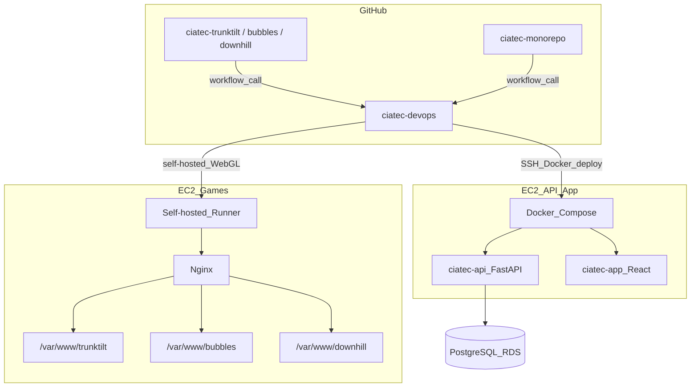

# Arquitetura — CIATec DevOps

Visão da infraestrutura e dos fluxos de deploy gerenciados por este repositório.

## Topologia

## Ambientes

### EC2 Games

| Item | Valor |
|------|--------|
| SO | Ubuntu |
| Web server | Nginx |
| CI/CD | GitHub Self-hosted Runner (já instalado) |
| Apps | 3 jogos Unity WebGL |

Caminhos de deploy (padrão; ajustar conforme servidor real):

| Jogo | Repositório | Deploy path |
|------|-------------|-------------|
| TrunkTilt | `ciatec-trunktilt` | `/var/www/trunktilt` |
| Bubbles | `ciatec-bubbles` | `/var/www/bubbles` |
| Downhill | `ciatec-downhill` | `/var/www/downhill` |

### EC2 API/App

| Item | Valor |
|------|--------|
| SO | Ubuntu |
| Runtime | Docker + Docker Compose |
| Compose dir (padrão) | `/opt/ciatec/` |
| Banco | PostgreSQL RDS (externo; não gerenciado pelo Compose) |

| Serviço | Stack | Container | Responsabilidade |
|---------|-------|-----------|------------------|
| `api` | FastAPI | `ciatec-api` | API REST, migrações Alembic |
| `app` | React/Vite | `ciatec-app` | Frontend web |

## Serviços, portas e responsabilidades

| Serviço | Host | Porta (típica) | Protocolo | Responsabilidade |
|---------|------|----------------|-----------|------------------|
| TrunkTilt | EC2 Games | 80/443 | HTTP(S) | Jogo WebGL |
| Bubbles | EC2 Games | 80/443 | HTTP(S) | Jogo WebGL |
| Downhill | EC2 Games | 80/443 | HTTP(S) | Jogo WebGL |
| ciatec-api | EC2 API/App | 8000 (interno) / 443 (público) | HTTP(S) | API + `/health` |
| ciatec-app | EC2 API/App | 80/443 | HTTP(S) | UI |
| PostgreSQL | RDS | 5432 | TCP | Dados persistentes |

Portas públicas exatas dependem de Nginx/ALB/security groups — documentar valores reais no runbook do ambiente quando confirmados.

## Fluxos de deploy

### Unity WebGL (EC2 Games)

1. Push em `main` no repositório do jogo
2. Caller workflow no repo do jogo invoca `ciatec-devops/.github/workflows/deploy-webgl.yml`
3. Job roda no **self-hosted runner** na EC2 Games
4. Valida pasta `Build/`, faz backup do deploy atual, copia para `deploy_path`
5. Ajusta permissões (`www-data`), `nginx -t`, `systemctl reload nginx`
6. Registra log em `/var/log/ciatec/deploys.log`
7. Em falha após backup: restaura `.bak`

### Docker — API + App (EC2 API/App)

1. Push em `main` no monorepo (com `paths` filter por `api/`, `app/`, `docker-compose.yml`)
2. Caller invoca `ciatec-devops/.github/workflows/deploy-docker.yml`
3. Runner GitHub-hosted conecta via **SSH** à EC2 API/App
4. Executa `scripts/deploy/deploy-docker.sh` (`api` | `app` | `all`)
5. `docker compose pull` → `up -d` → health check → rollback se falhar
6. No deploy da API: migrações Alembic **antes** de promover o container novo (Sprint 4)

## Variáveis de ambiente (nomes apenas)

### WebGL / EC2 Games

| Variável | Uso |
|----------|-----|
| `DEPLOY_LOG_PATH` | Log de deploys (default `/var/log/ciatec/deploys.log`) |
| `TRUNKTILT_URL` | URL pública para health check |
| `BUBBLES_URL` | URL pública para health check |
| `DOWNHILL_URL` | URL pública para health check |

### Docker / EC2 API/App

| Variável | Uso |
|----------|-----|
| `COMPOSE_DIR` | Diretório do `docker-compose.yml` |
| `API_HEALTH_URL` | Endpoint de health da API |
| `APP_HEALTH_URL` | URL do App |
| `DATABASE_URL` / connection string | Acesso da API ao RDS (no container) |

### Secrets GitHub (organização / repos)

| Secret | Uso |
|--------|-----|
| `EC2_API_HOST` | Host da EC2 API/App |
| `EC2_SSH_KEY` | Chave privada SSH |
| `EC2_SSH_USER` | Usuário SSH (ex.: `ubuntu`) |

## Repositórios relacionados

| Repo | Papel |
|------|--------|
| `ciatec-devops` | Workflows reutilizáveis, scripts, docs, runbooks |
| `ciatec-trunktilt` | Jogo WebGL + caller de deploy |
| `ciatec-bubbles` | Jogo WebGL + caller de deploy |
| `ciatec-downhill` | Jogo WebGL + caller de deploy |
| `ciatec-monorepo` | API + App + caller de deploy Docker |
