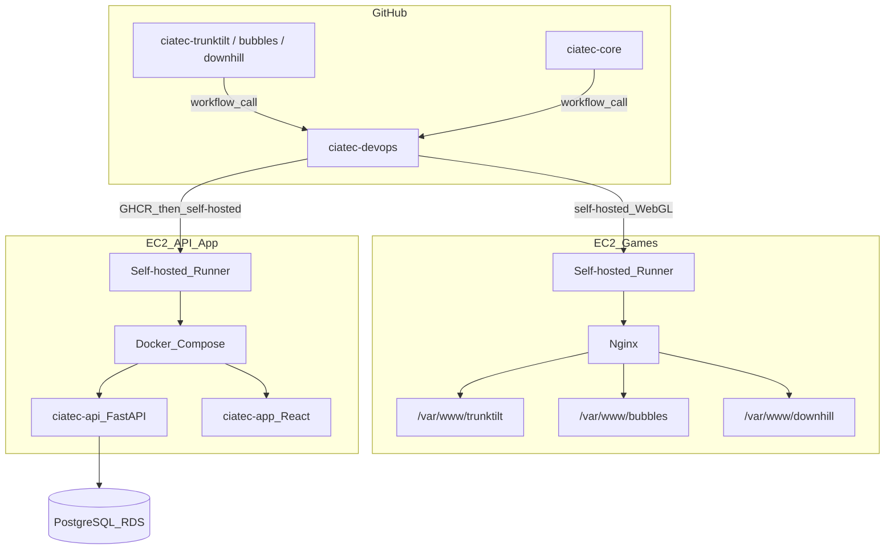

# Arquitetura — CIATec DevOps

Visão da infraestrutura e dos fluxos de deploy gerenciados por este repositório.

## Topologia

## Ambientes

### EC2 Games

| Item | Valor |
|------|--------|
| SO | Ubuntu |
| Web server | Nginx |
| CI/CD | GitHub Self-hosted Runner (já instalado) |
| Apps | 3 jogos Unity WebGL |

Caminhos de deploy (padrão; ajustar conforme servidor real):

| Jogo | Repositório | Deploy path |
|------|-------------|-------------|
| TrunkTilt | `ciatec-trunktilt` | `/var/www/trunktilt` |
| Bubbles | `ciatec-bubbles` | `/var/www/bubbles` |
| Downhill | `ciatec-downhill` | `/var/www/downhill` |

### EC2 API/App

| Item | Valor |
|------|--------|
| SO | Ubuntu |
| Runtime | Docker + Docker Compose |
| Monorepo clone | `/home/ubuntu/ciatec-core` (`src/api`, `src/app`) |
| CI/CD | Self-hosted runner (`ec2-ciatec-core`) + imagens GHCR |
| Banco | PostgreSQL RDS (externo; `.env` só na EC2) |

| Serviço | Stack | Imagem | Responsabilidade |
|---------|-------|--------|------------------|
| `api` | FastAPI | `ghcr.io/ciatec-org/ciatec-api:main` | API REST; Alembic no start do container |
| `web` | React/Vite → Nginx | `ghcr.io/ciatec-org/ciatec-app:main` | Frontend estático |

## Serviços, portas e responsabilidades

| Serviço | Host | Porta (típica) | Protocolo | Responsabilidade |
|---------|------|----------------|-----------|------------------|
| TrunkTilt | EC2 Games | 80/443 | HTTP(S) | Jogo WebGL |
| Bubbles | EC2 Games | 80/443 | HTTP(S) | Jogo WebGL |
| Downhill | EC2 Games | 80/443 | HTTP(S) | Jogo WebGL |
| ciatec-api | EC2 API/App | 8000 (interno) / 443 (`api.ciatec.org`) | HTTP(S) | API + `/health` |
| ciatec-app | EC2 API/App | 8081 (interno) / 443 (`research.ciatec.org`) | HTTP(S) | UI |
| PostgreSQL | RDS | 5432 | TCP | Dados persistentes |

## Fluxos de deploy

### Unity WebGL (EC2 Games)

1. Push em `main` no repositório do jogo
2. Caller workflow no repo do jogo invoca `ciatec-devops/.github/workflows/deploy-webgl.yml`
3. Job roda no **self-hosted runner** na EC2 Games
4. Valida pasta `Build/`, faz backup do deploy atual, copia para `deploy_path`
5. Ajusta permissões (`www-data`), `nginx -t`, `systemctl reload nginx`
6. Registra log em `/var/log/ciatec/deploys.log`
7. Em falha após backup: restaura `.bak`

### Docker — API + App (EC2 API/App) — fluxo actual

1. Push em `main` no `ciatec-core` (`src/api/**` ou `src/app/**`) ou `workflow_dispatch`
2. Caller no monorepo: `deploy-api.yml` / `deploy-app.yml`
3. **GitHub-hosted:** CI → `build-push-ghcr.yml` → tags `:main` e `:sha-<7>` (`GITHUB_TOKEN`, sem PAT)
4. **Self-hosted** na EC2 (`deploy-compose.yml`): `git pull` → login GHCR → `docker compose pull` → `up -d` → health (+ smoke na API)
5. Migrações Alembic: no `CMD` da imagem da API (não duplicar no script de deploy)

> Legado: `deploy-docker.yml` (SSH + scripts em `/opt/ciatec`) permanece no repo mas **não** é o caminho do `ciatec-core`.

## Variáveis de ambiente (nomes apenas)

### WebGL / EC2 Games

| Variável | Uso |
|----------|-----|
| `DEPLOY_LOG_PATH` | Log de deploys (default `/var/log/ciatec/deploys.log`) |
| `TRUNKTILT_URL` | URL pública para health check |
| `BUBBLES_URL` | URL pública para health check |
| `DOWNHILL_URL` | URL pública para health check |

### Docker / EC2 API/App

| Variável | Uso |
|----------|-----|
| `DATABASE_URL` / secrets no `.env` | Só na EC2 (`src/api/.env`); nunca no CI |
| Compose | `image: ghcr.io/ciatec-org/ciatec-*:main` em `src/api` e `src/app` |

### Secrets GitHub

| Secret | Uso |
|--------|-----|
| *(nenhum obrigatório para monorepo GHCR)* | `GITHUB_TOKEN` com `packages: write` / `packages: read` |
| `EC2_API_HOST` / `EC2_SSH_*` | Só para o fluxo SSH legado (`deploy-docker.yml`) |
| `DEPLOY_LOG_PATH` | WebGL (opcional) |

## Repositórios relacionados

| Repo | Papel |
|------|--------|
| `ciatec-devops` | Workflows reutilizáveis, scripts, docs, runbooks |
| `ciatec-trunktilt` | Jogo WebGL + caller de deploy |
| `ciatec-bubbles` | Jogo WebGL + caller de deploy |
| `ciatec-downhill` | Jogo WebGL + caller de deploy |
| `ciatec-core` | Monorepo API + App + callers GHCR / self-hosted |

Runbook monorepo: [runbooks/deploy-monorepo.md](runbooks/deploy-monorepo.md).
